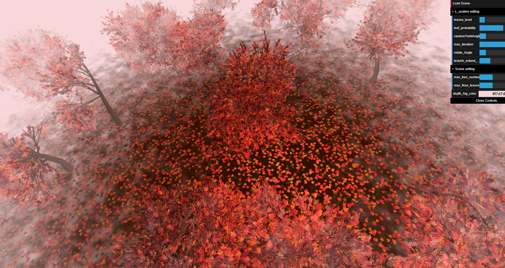
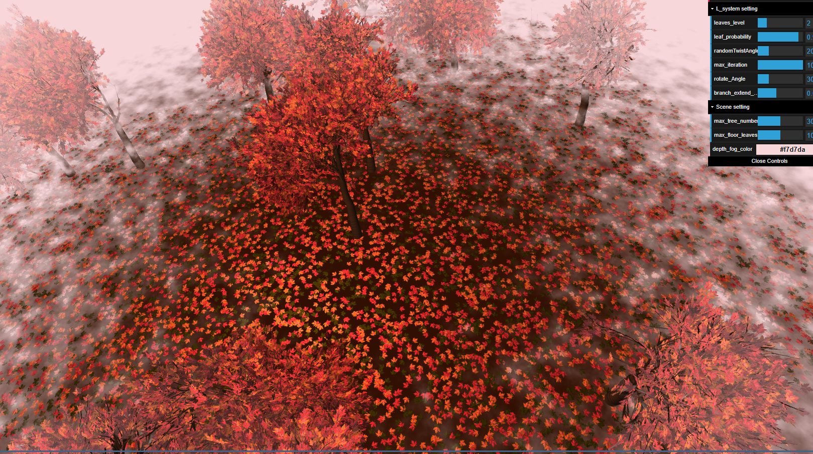
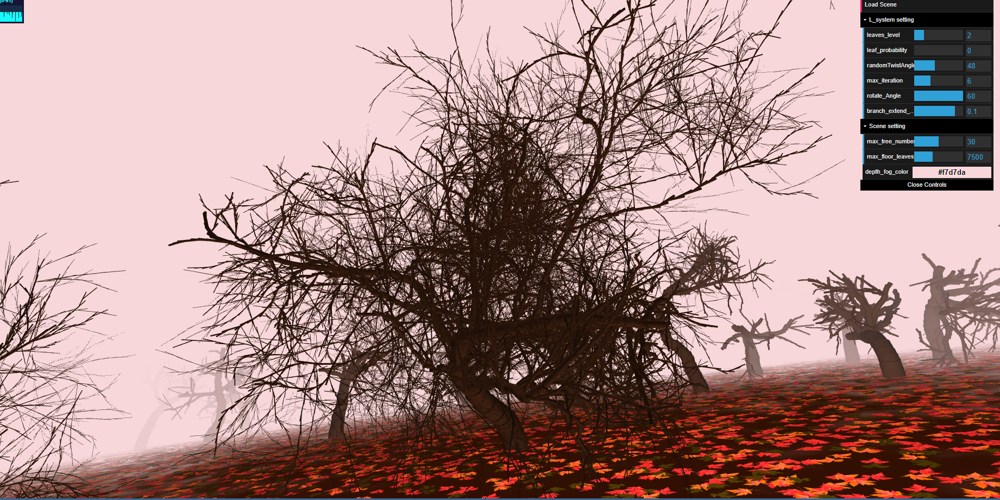
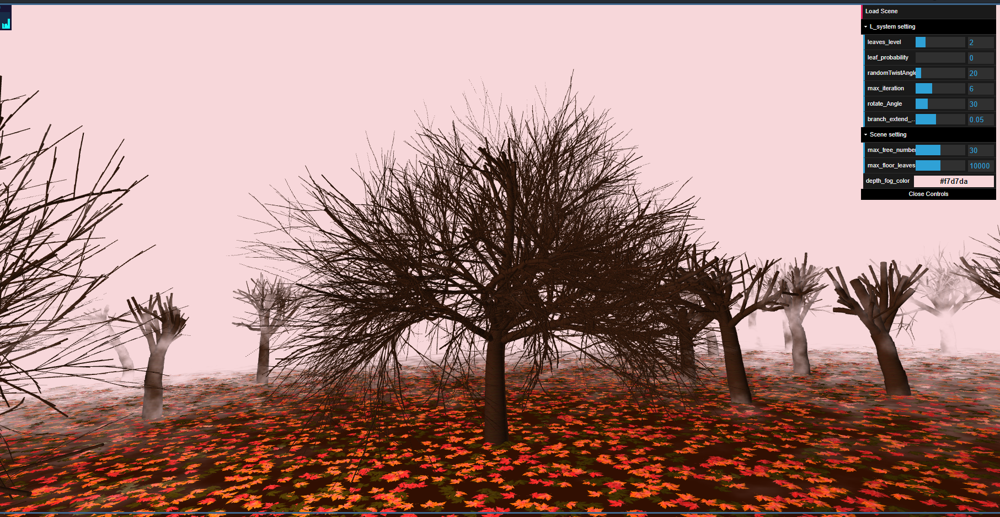

## Real-time demo
- Link:  https://seiseiko.github.io/l-systems/

## Screenshots


### L-system Attribute
#### Scene randomness
The array of L-system instances are generated randomly. I divide the ground into 5x6 grids and place L-system randomly on one grid based on several parameter:
- Max iteration by gui
- Max tree number by gui
```
// random number of trees
let num = getRandomInt(scene_control.max_tree_number*0.8, scene_control.max_tree_number);
....
 for(var i = 0; i<num;i++){
    var index = Math.floor(Math.random()*grids.length);
    var grid = grids[index]; // randomly shuffle a grid from grids
    grids.splice(index, 1); // remove that grid
    var iter = getRandomInt(l_system_control.max_iteration-2.0, l_system_control.max_iteration);
    // each tree needs at least around 6 * 5, place them randomly 
    var pos = vec3.fromValues(grid[0]*6+generateRandomNumber(3,3.5),0,-grid[1]*5-generateRandomNumber(2,4));
    l_system[i+2] = new Lsystem(pos,iter);
  }
```

num=25 

num=25

(num=50)

#### Random Leaves Generation
Leaves are generated randomly based on 
- current branch levels 
- randomly chosen color 
- probability threshold set up by gui
#### Random Twist
Branch are twisted randomly based on twist angle set up by gui.
Angle = 48

Angle = 20

#### Expanding Rule with Probability
See `ExpansionRule.ts` for details.
#### Infinite Growth Prevention
- To prevent infinite Growth, when scale is less than 0.002, we will stop drawing.
#### Animation & Lighting
Leaves are animated in vertex shader. Basic directional light with noisy depth fog.


(without noise)

### Interactive Parameters
#### L-system
- leaf level: the min level leaves allowed to grow
- leaf probability: the probability leaf can be drawn
- random twist angle
- max iteration: the max iterations each l-system can have
- roate angle
- branch_extend_probability: trees grow higher if this probability goes up
#### Scene
- max tree number
- max floor leaves: max leaves we have on the ground
- depth fog color

## Implementation Details

### Class hierachy:
#### `L-system`
`L-system` contains the instance of `ExpansionRule` and `DrawingRule` we used in the program, and sets up mesh by `load_mesh()`.
-  `draw()` expand the axiom and calculate the drawing result.

#### `ExpansionRule`
- `expand(iter:number)`: expand the `this.axiom` and store the result string in `this.expanded_string` 
- `expansionRule(Map<string, any>)` contains expansion rules we used with probability:
```
this.expansionRule.set('A', this.A.bind(this));
this.expansionRule.set('B', this.B.bind(this));
this.expansionRule.set('F', this.F.bind(this));
```
#### `DrawingRule`
Drawing Rule contains all the instance information we required for rendering and is responsible generate them given the expanded string.
- `drawingRule` is a mapping `Map<string, any>` from grammar to according drawing function, set up by
```
// set up drawing rule map
this.drawingRule.set('F', this.drawForward.bind(this));
this.drawingRule.set('J', this.drawLeaf.bind(this));
this.drawingRule.set('[',this.branchIn.bind(this));
this.drawingRule.set(']',this.branchOut.bind(this));
this.drawingRule.set('+',this.rotateUpPos.bind(this));
this.drawingRule.set('-',this.rotateUpNeg.bind(this));
this.drawingRule.set('\\',this.rotateLookPos.bind(this));
this.drawingRule.set('/',this.rotateLookNeg.bind(this));
this.drawingRule.set('^',this.rotateRightPos.bind(this));
this.drawingRule.set('&',this.rotateRightNeg.bind(this));

```

- `draw(grammar:string)` is the main function that perform the drawing using `Turtle` and run function `drawingRule['character']` 

### Instanced Rendering: 
Each vertex are passed with different
- Position
- Quaternion
- Scale

to enable instaved rendering. Each mesh has an according  `Instance Info` instance calculated by `DrawingRule`  and we call `update vbo` to set up the buffer.


## Citation and resources
- [The Algorithmic Beauty of Plants](http://algorithmicbotany.org/papers/abop/abop-ch1.pdf)
- [OpenGL Instanced Rendering (Learn OpenGL)](https://learnopengl.com/Advanced-OpenGL/Instancing)
- [OpenGL Instanced Rendering (OpenGL-Tutorial)](http://www.opengl-tutorial.org/intermediate-tutorials/billboards-particles/particles-instancing/)
